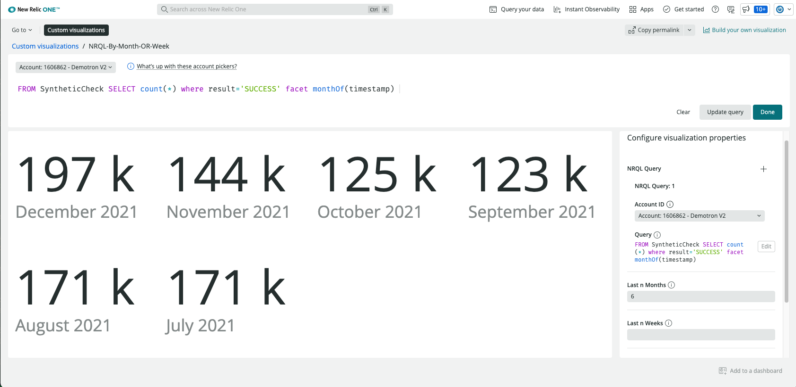
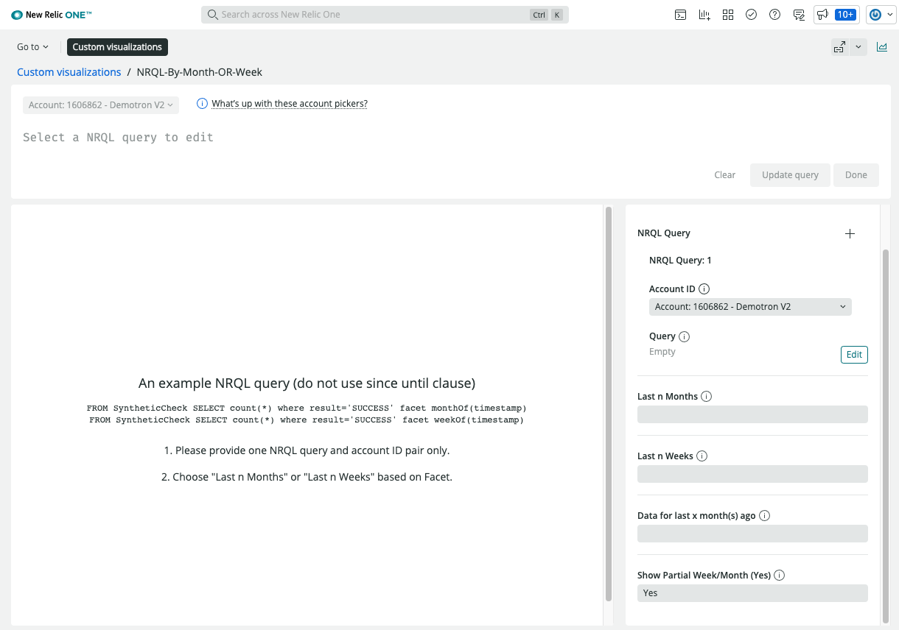
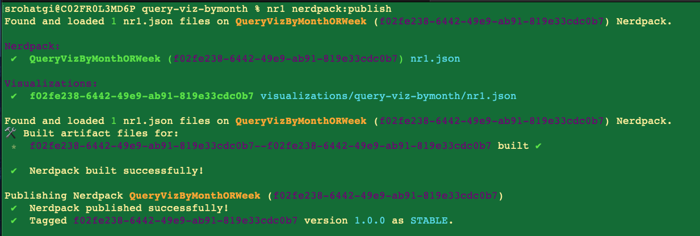
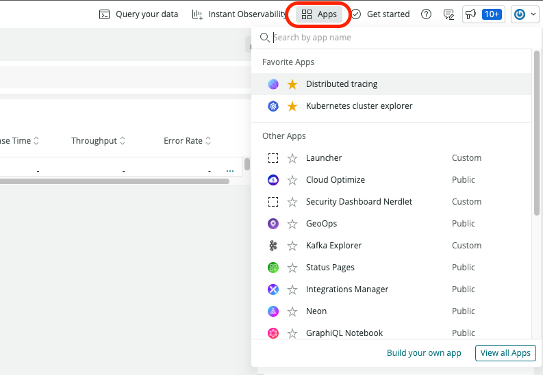
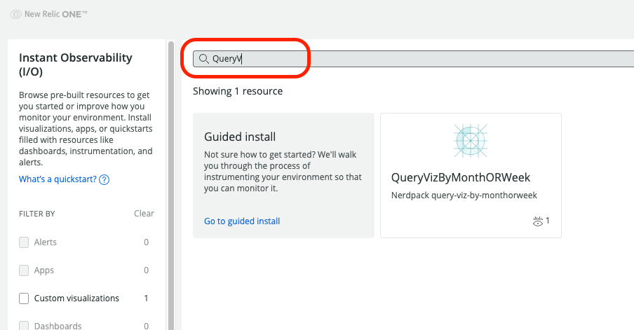
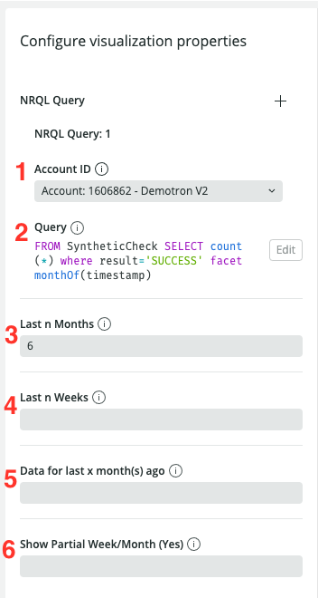

# [NR1-Viz-NRQL-By-MonthORWeek - Add Visualization to Dashboards] 

   - [Introduction](#intro)
   - [Use Cases](#use-cases)
   - [Pre-requisites](#pre-reqs)
   - [App Installation](#install)
   - [Configuration](#config)
   - [Search App](#search)
   - [Support](#support)
   - [Issues and Roadmap](#issues)
   - [Security](#security)
   - [License](#license)

# Introduction 

NR1-Viz-NRQL-By-MonthORWeek enhances NRQL timeline facet capability by enabling user to pull data for complete month(s) or week(s) or an exact Month.

   - Retrieve data aggregated by months for last n Months
   - Retrieve data aggregated by months for last n Months and also include partial month data for the current month
   - Get data aggregated by weeks for last n Weeks
   - Get data aggregated by weeks for last n Weeks and also include partial week data for the current week
   - Retrieve data for a certain month relative to the current month

   > 

## Use Cases 

   1. Reports to Compare Monthly data 
      e.g. In terms of Page Views or ... what progress are we making on monthly basis?

   2. Analyze Weekly Trends
      e.g. What is our weekly pattern for Page Views or ...?

   3. Quarterly Month Comparision
      e.g. Is the first month of the last quarter was slow in terms of Page Views or ... compared to current quarter?

   4. Current Month/Week progress compared to past months/week 
      e.g. How are we fairing/progressing in terms of Page Views or ...?

## Pre-requisites 

   - Familarity with [NRQL](https://docs.newrelic.com/docs/query-your-data/nrql-new-relic-query-language/get-started/introduction-nrql-new-relics-query-language/).
   - New Relic agents installed and reporting data to New Relic One Platform
   - Ability to Install NR Apps and create New Relic Dashboards. 

## App Installation 

   - Clone/download the repo
   - run `npm install`
   - run `nr1 nerdpack:uuid -gf`

   Follow these instructions to [test locally](https://developer.newrelic.com/build-apps/publish-deploy/serve/).

   > 

   Follow these instructions to [publish](https://developer.newrelic.com/build-apps/publish-deploy/publish/) the app to New Relic, and [subscribe](https://developer.newrelic.com/build-apps/publish-deploy/subscribe/) your account to use it.

   > nr1 nerdpack:publish
   
   As shown below:
   
   > 

## Search in New Relic Apps 
   Type QueryVizByMonthORWeek   or   QueryV   or   Month   or ... to find the App.
   
   - Step 1 
   > 
   
   - Step 2
   > 
   
## Configuration  
   1. Select an Account ID to be associated with the query. 
   2. NRQL for the Account selected without time range.
   3. Specify the number of months to fetch data for, excluding current
   4. Enter last n Weeks (if months is blank), For this widget start of the week is Monday.
   5. Fetch a month data for last x month(s) ago (only works if weeks and months are blank). 
        Example: If current month is January, then 3 months ago will be October
   7. Type Yes to enable partial data retrieval.

   > 

## Support  

   New Relic hosts and moderates an online forum where customers can interact with New Relic employees as well as other customers to get help and share best practices. Like all official New Relic open source projects, there's a related Community topic in the New Relic Explorers Hub. [support](https://github.com/newrelic-experimental/NR1-Viz-NRQL-By-MonthORWeek/issues)

## Issues and Roadmap 

   To view a listing of enhancement requests and known bugs - or to request a new feature or report a bug - please visit the repository [issues page](https://github.com/newrelic-experimental/NR1-Viz-NRQL-By-MonthORWeek/issues).
   **A note about vulnerabilities**

## Security 

   As noted in our [security policy](../../security/policy), New Relic is committed to the privacy and security of our customers and their data. We believe that providing coordinated disclosure by security researchers and engaging with the security community are important means to achieve our security goals.

   If you believe you have found a security vulnerability in this project or any of New Relic's products or websites, we welcome and greatly appreciate you reporting it to New Relic through [HackerOne](https://hackerone.com/newrelic).

## License 
   [NR1-Viz-NRQL-By-MonthORWeek] is licensed under the [Apache 2.0](http://apache.org/licenses/LICENSE-2.0.txt) License.
   >[If applicable: The [NR1-Viz-NRQL-By-MonthORWeek] also uses source code from third-party libraries. You can find full details on which libraries are used and the terms under which they are licensed in the third-party notices document.]
